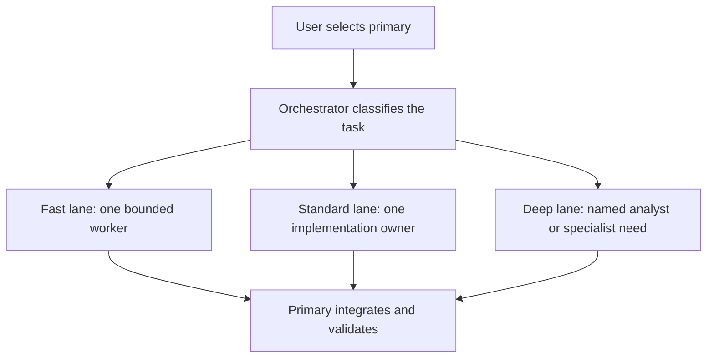
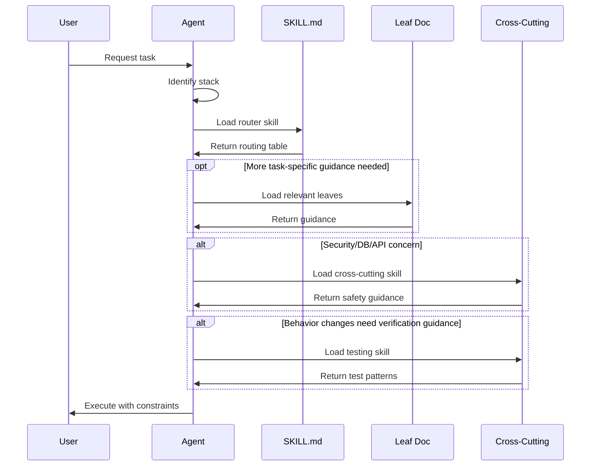
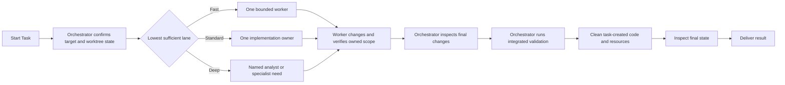

# OpenCode Config + Skill Library

> **Production-grade LLM coding configuration with router-first skill architecture**

This repository contains a comprehensive OpenCode configuration system designed to make AI coding assistants predictable, consistent, and production-quality across projects.

## Table of Contents

1. [Overview](#overview)
2. [Agent Types](#agent-types)
3. [Skills Inventory](#skills-inventory)
4. [Skill Structure & Philosophy](#skill-structure--philosophy)
5. [Commands](#commands)
6. [Configuration](#configuration)
7. [Workflow Guide](#workflow-guide)
8. [Project Setup](#project-setup)
9. [Quality Assurance](#quality-assurance)
10. [Contributing](#contributing)

---

## Overview

This repository provides a complete OpenCode configuration system with:

- **35+ specialized skills** covering languages, frameworks, and cross-cutting concerns
- **Router-first architecture** for precise, minimal context loading
- **Premium, Luna economy, and direct DeepSeek coding families with shared specialist workers**
- **Isolated premium and economy PR-review pipelines with lossless artifacts**
- **Opt-in full-lifecycle YOLO mode with soft consequential-action gates**
- **25+ custom commands** for common workflows
- **Project-local skill support** for team conventions
- **Guardrails and linting** to prevent skill drift

### Core Philosophy

**Skills are the primary mechanism for consistent output.** Instead of relying on the model's training data, we explicitly load focused, versioned guidance that constrains behavior.

The system follows these principles:

1. **Route first, then implement** - Pick the smallest focused guide that fits
2. **Project-local wins** - Repo-specific conventions override global defaults
3. **Load only what you need** - Prevent context bloat with precise routing
4. **Explicit over implicit** - Decision rules, checklists, and anti-patterns over generic advice

### The Foundational Principle

> **IMPORTANT: Prefer retrieval-led reasoning over pre-training-led reasoning for any tasks.**
>
> **Before writing code, first explore the project structure, then invoke the skills, rules and standards for documentation.**

This principle, inspired by [Vercel's research](https://vercel.com/blog/agents-md-outperforms-skills-in-our-agent-evals), is what makes this entire system work. Instead of letting the AI rely on its training data (which may be outdated, inconsistent, or wrong), we force it to **retrieve** specific, current, project-relevant guidance before acting.

**Why this matters:**

- **Consistency** - Every task follows the same conventions, regardless of which AI model is used
- **Accuracy** - Skills contain up-to-date patterns (2024-2026) rather than potentially stale training data
- **Predictability** - Same input produces same output because constraints are explicit
- **Team alignment** - Project-local skills encode team conventions that everyone follows

This is the glue that binds everything together: the router-first architecture, the skill loading protocol, the guardrails, and the quality checks all serve this single principle—**retrieve before you reason**.

---

## Agent Types

Agents define the model, execution boundary, permissions, and cost profile. Skills define reusable methods and constraints. Most skills are selected from the actual task; role-contract skills are the deliberate exception and must be loaded by their wrappers before any role work begins.

### Coding Army

#### Mid tier

| Agent                       | Model                 | Reasoning | Responsibility                                                |
| --------------------------- | --------------------- | --------- | ------------------------------------------------------------- |
| **orchestrator**            | `openai/gpt-5.6-sol`  | `high`    | Primary commander, integrator, and final validator            |
| **principal-engineer**      | `openai/gpt-6-astra`  | `high`    | Architecture, high-risk work, deep debugging, and rescue work |
| **implementation-engineer** | `openai/gpt-5.6-sol`  | `medium`  | Implementation, debugging, testing, and integration           |
| **bounded-worker**          | `openai/gpt-5.6-luna` | `high`    | Narrow, repetitive, isolated, and testable work               |
| **repository-analyst**      | `openai/gpt-5.6-sol`  | `medium`  | Read-only repository mapping and migration planning           |

The global default agent is `economy-orchestrator`; the global model fallback remains Astra for roles that inherit it. All ten named coding, YOLO, and PR-review orchestrators explicitly use Sol high. Other primaries and non-orchestrator roles retain their role-specific assignments below. Workers use the role-specific assignments below, not the parent's model. Exceptional review is limited to the six PR-review-capable orchestrators; the shared 3D Modeler is available to the eight coding and YOLO orchestrators. Other permissions and depth 1 are preserved. Restart OpenCode after configuration or prompt edits and start a new session; existing sessions or explicit overrides can retain different settings.

#### Economy tier

| Agent                               | Model                 | Reasoning | Responsibility                     |
| ----------------------------------- | --------------------- | --------- | ---------------------------------- |
| **economy-orchestrator**            | `openai/gpt-5.6-sol`  | `high`    | Weekly default coordinator         |
| **economy-implementation-engineer** | `openai/gpt-5.6-luna` | `xhigh`   | Cost-efficient implementation      |
| **economy-bounded-worker**          | `openai/gpt-5.6-luna` | `high`    | Mechanical and tightly scoped work |
| **economy-repository-analyst**      | `openai/gpt-5.6-luna` | `high`    | Read-only repository analysis      |

Use the `eco-max` profile deliberately for substantial implementation that justifies Luna max; file count alone is not the trigger. Route unfamiliar terminal/debugging/integration work to Mid, or use a permitted stronger specialist for a named capability gap. The Economy Implementation Engineer owns frontend implementation; visual product judgment and acceptance review belong with the UI/UX Analyst.

#### Flash tier

| Agent                             | Model                                          | Reasoning | Responsibility                      |
| --------------------------------- | ---------------------------------------------- | --------- | ----------------------------------- |
| **flash-orchestrator**            | `openai/gpt-5.6-sol`                           | `high`    | Coordinator for the Flash pool      |
| **flash-implementation-engineer** | `deepseek/deepseek-v4.1-flash-expires-on-0910` | `max`     | Direct DeepSeek implementation      |
| **flash-bounded-worker**          | `deepseek/deepseek-v4.1-flash-expires-on-0910` | `max`     | Direct DeepSeek mechanical work     |
| **flash-repository-analyst**      | `deepseek/deepseek-v4.1-flash-expires-on-0910` | `max`     | Direct DeepSeek read-only analysis  |
| **flash-vision-scout**            | `deepseek/deepseek-v4.1-flash-expires-on-0910` | `max`     | Factual local image inspection only |

Flash workers use the vision-capable V4.1 Flash beta directly at `https://api.deepseek.com`, not an intermediary provider. All five Flash subagents, including the reviewer and factual vision scout, use `max`. Both Flash orchestrators use Sol `high`; shared specialists retain their own model assignments. Consider this reserve at roughly 15-20% remaining allowance, adjusted for hours until renewal; it still consumes OpenAI allowance for coordination and separately billed DeepSeek API usage for workers. Extra Astra specialist use is deliberate and bounded. No automatic switching, watcher, or reset is configured. The Flash Implementation Engineer owns implementation and browser validation. The scout accepts images, including rendered PDF pages and extracted video frames, not raw PDF/video attachments, and remains factual and exclusive to Flash.

The temporary `deepseek/deepseek-v4.1-flash-expires-on-0910` beta is also available through `/models`, using the existing DeepSeek connection. Its announcement indicates expiry on September 10, 2026; the exact cutoff is unconfirmed. The configuration carries forward V4 Flash's pricing metadata and 384K output limit pending published beta specifications, but caps context at 258K so Flash sessions auto-compact earlier (per-model lever; `compaction.reserved` is global-only), with text/image input and `low`/`high`/`max` reasoning variants. Both normal and YOLO Flash use the updated worker pool without changing the global default. Reassign these workers when the beta expires; no automatic fallback is configured.

#### Eco Fast tier

| Agent                                | Model                      | Reasoning | Responsibility                             |
| ------------------------------------ | -------------------------- | --------- | ------------------------------------------ |
| **eco-fast-orchestrator**            | `openai/gpt-5.6-sol`       | `high`    | Coordinator for the Eco Fast pool          |
| **eco-fast-implementation-engineer** | `openai/gpt-5.6-luna-fast` | `xhigh`   | Complete implementation ownership          |
| **eco-fast-bounded-worker**          | `openai/gpt-5.6-luna-fast` | `high`    | Narrow mechanical work                     |
| **eco-fast-repository-analyst**      | `openai/gpt-5.6-luna-fast` | `high`    | Read-only repository analysis              |
| **eco-fast-pr-reviewer**             | `openai/gpt-5.6-luna-fast` | `max`     | Target-branch review and findings artifact |

Fast routes are installed OpenCode model aliases mapping to the same underlying model with `serviceTier: priority`. They preserve reasoning effort and verification requirements. Bare Eco Fast entry points accelerate their named pool; shared specialists retain their normal settings unless the `fast` profile is selected. Priority processing may consume more allowance or cost and does not guarantee a measured end-to-end speedup.

#### Optional execution profiles

Profiles reuse existing agents and permissions. Select a profile directory for the process; do not assume a parent `--model` or `--variant` changes pinned children.

```bash
# Normal weekly default; Mid is explicitly selected when needed.
opencode
opencode --agent orchestrator

# High: named orchestrators and the implementation owner use Sol high.
OPENCODE_CONFIG_DIR="$HOME/.config/opencode/profiles/high" opencode

# Mid Fast, High Fast, or Eco Fast including shared review/specialist calls.
OPENCODE_CONFIG_DIR="$HOME/.config/opencode/profiles/fast" opencode
OPENCODE_CONFIG_DIR="$HOME/.config/opencode/profiles/high-fast" opencode
OPENCODE_CONFIG_DIR="$HOME/.config/opencode/profiles/fast" opencode --agent eco-fast-orchestrator

# Deliberate Luna max implementation, without raising coordinator effort.
OPENCODE_CONFIG_DIR="$HOME/.config/opencode/profiles/eco-max" opencode
```

The same profile directories work with existing YOLO launchers, for example `OPENCODE_CONFIG_DIR="$HOME/.config/opencode/profiles/high-fast" yolo`. No launcher or YOLO permission changes are needed. `eco-max` can also be used with `yolo-eco` or `yolo-eco-fast`. Select High before a difficult mission; use the existing Astra high principal for a named deeper reasoning need. Worker-only overrides can be explicit, for example `OPENCODE_CONFIG_CONTENT='{"agent":{"implementation-engineer":{"variant":"high"}}}'` with a High profile and plain `opencode`. Existing YOLO launchers own `OPENCODE_CONFIG_CONTENT`, so do not use that variable to layer custom overrides through them.

These profile directories load after normal project configuration in OpenCode 1.18.29; inline or managed settings can still override them. They are deliberate process-wide choices, not live task-level switches. Unset `OPENCODE_CONFIG_DIR` and restart to return to base assignments. Do not rewrite role files or discard unrelated changes to leave a preset. Validate actual accepted work before claiming savings; no paid performance calibration was performed.

#### Shared UI specialist

| Agent             | Model                | Reasoning | Responsibility                                                                 |
| ----------------- | -------------------- | --------- | ------------------------------------------------------------------------------ |
| **ui-ux-analyst** | `openai/gpt-6-astra` | `medium`  | UI/UX consultation, planning, validation, and frontend review; no product code |

Substantial UI/UX plans and reviews are written to Markdown artifacts. Orchestrators pass the exact artifact path to implementation and review workers instead of compressing the plan into a handoff summary, and workers treat the file as the authoritative requirements and acceptance checklist.

The [UI/UX handoff protocol](skills/orchestrator-contract/ui-ux-handoff.md) adds stable requirement IDs, per-item revisions, and a JSON acceptance block inside that same Markdown file. UI/UX owns source requirements and review verdicts; the parent records scope decisions; workers acknowledge reads and supply implementation evidence. The parent resumes the same worker for repairs and the UI/UX owner for bounded acceptance review. Shared-artifact writes are serialized. Trivial frontend fixes and small inline consultations do not need this protocol.

Before claiming completion, the parent runs `node "$HOME/.config/opencode/scripts/ui-ux-acceptance.mjs" "path/to/UI_UX_PLAN.md" --revision 1` with the actual path and accepted artifact revision. All accepted IDs need current read/evidence/review revisions and an evidence-backed UI/UX pass. Excluding a required item needs an actual user scope-change reference. The read-only checker detects structural gaps, not visual correctness or fabricated evidence; it is an instruction-level acceptance requirement, not a runtime completion lock. UI/UX remains shell-denied and returns its evidence to the parent. Run its regression checks with `bun test scripts/ui-ux-acceptance.test.js`.

#### Shared 3D specialist

| Agent          | Model                | Reasoning | Responsibility                                               |
| -------------- | -------------------- | --------- | ------------------------------------------------------------ |
| **3d-modeler** | `openai/gpt-6-astra` | `high`    | Blender asset creation, scene editing, and validated exports |

Use `@3d-modeler` directly or let any coding/YOLO orchestrator assign requested 3D asset work. The modeler owns the asset lifecycle, including applicable geometry, UVs, materials, lighting, rigs, animation, optimization, and export checks. It uses the existing Blender MCP connection when available, preserves unrelated scene content, and does not delegate. Live scene mutation is serialized under one owner; it is not safe to run multiple modeling workers against the same Blender session.

The orchestrator passes the verbatim modeling request, exact accepted design-artifact paths, and export requirements. The modeler returns exact source/export paths and, for substantial work, a task-local Markdown handoff covering applicable units, axes, origins, dependencies, clips, licensing, evidence, and remaining checks. The implementation engineer reads that handoff for application integration; UI/UX retains product-design judgment. Existing Fast profiles do not retarget this agent: it remains Astra high. Blender must be running with its MCP server connected for live scene work; configuring the agent does not start or repair Blender.

#### Architecture primary

| Agent                | Mode    | Model                | Reasoning | Responsibility                                                                          |
| -------------------- | ------- | -------------------- | --------- | --------------------------------------------------------------------------------------- |
| **system-architect** | primary | `openai/gpt-6-astra` | `xhigh`   | Architecture decisions, reviews, migrations, specialist synthesis, and design artifacts |

The System Architect is Markdown-only and can delegate bounded current-state analysis, consequential technical review, architecture-relevant UI/UX consultation, and an explicitly scoped current-state code audit. Audit is not automatic for architecture work and does not authorize implementation. Accepted designs hand off to a coding orchestrator through durable artifacts.

#### Repository planner

Use `/plan <task>` or select `planner` for a repository-focused implementation plan. `/update-plan <change>` revises the same document. The planner uses Sol high, leaves the default agent unchanged, and can investigate code but edit only Markdown plans under `.plans` or `plans`.

The planner recommends an approach, asks consequential questions through OpenCode's question tool with a recommended answer, and explains risks, steps, and verification in plain language. Architecture and system-design skills support relevant decisions; they are not mandatory stages or separate document packages. All three use small Mermaid diagrams with text explanations in their main saved documents.

Plans use the existing `.plans` or `plans` directory at the active repository root. If both exist, the relevant existing plan or convention wins; otherwise `.plans` is preferred. If neither exists, the planner creates `.plans`. Follow-ups update the existing plan. A ready plan is not authorization to implement, commit, or deploy.

Plan-file permissions also cover new project directories without Git. With GPT models, OpenCode exposes `apply_patch` for file creation and updates instead of separate `write` and `edit` tools; the `edit` permission controls those operations.

All configured MCP tools are available to the planner, including Context7, Coolify, and project-provided Plane tools. The planning instructions restrict their use to investigation; remote mutation tools are not hidden by a per-server deny list. File, shell, delegation, and external-directory restrictions still apply. Empty MCP resource lists do not establish that the server's tools are unavailable.

The main document explains what was found, the recommended approach, risks and unknowns, implementation steps, and verification or rollout. Skill guidance is shared through `skills/planning/`, `skills/architecture-design/`, and `skills/system-design/`; this installation's `skills` directory points to `~/.agent-configs/skills`. Restart OpenCode after changes to load the new agent, commands, and guidance.

The other delegating non-coding primaries use Sol: `biz-dev` uses medium and `ops-pm` uses high. Their existing tool and artifact restrictions are unchanged. `raw` still inherits unless explicitly overridden; hidden built-in utilities are not retuned by this rollout. UI/UX, 3D modeling, adjudication, architecture, principal engineering, and exceptional review have explicit Astra assignments. Fast profiles use Sol Fast for the migrated implementation, repository, and standard-review roles; Astra exceptions retain their existing Fast routes where configured.

#### Explicit code audit

| Agent            | Mode | Model                | Reasoning | Responsibility                                                   |
| ---------------- | ---- | -------------------- | --------- | ---------------------------------------------------------------- |
| **code-auditor** | all  | `openai/gpt-5.6-sol` | `medium`  | Explicit read-only audits for named code and system risk domains |

Invoke `/audit <scope and domains>` or `/security <scope>` to select the Code Auditor. Normal orchestrators and implementation workers are denied the `code-audit` skill, and the Code Auditor cannot edit or delegate. It may identify missing controls because audit is explicit, but its findings remain recommendations until the user selects them in a separate implementation request. System Architect is the only role with a controlled exception, limited to an explicitly named current-state audit inside an architecture mission.

#### PR review pipeline

| Agent                              | Mode     | Model                                          | Reasoning | Responsibility                                      |
| ---------------------------------- | -------- | ---------------------------------------------- | --------- | --------------------------------------------------- |
| **pr-review-orchestrator**         | primary  | `openai/gpt-5.6-sol`                           | `high`    | Standard single and batch PR-review coordination    |
| **economy-pr-review-orchestrator** | primary  | `openai/gpt-5.6-sol`                           | `high`    | Economy single and batch PR-review coordination     |
| **pr-reviewer**                    | subagent | `openai/gpt-5.6-sol`                           | `medium`  | Consequential and normal expert-level PR review     |
| **economy-pr-reviewer**            | subagent | `openai/gpt-5.6-luna`                          | `max`     | Economy target-branch review and findings artifact  |
| **exceptional-pr-reviewer**        | subagent | `openai/gpt-6-astra`                           | `xhigh`   | Only necessary beyond-expert reasoning              |
| **flash-pr-reviewer**              | subagent | `deepseek/deepseek-v4.1-flash-expires-on-0910` | `max`     | Flash target-branch review and findings artifact    |
| **pr-review-adjudicator**          | subagent | `openai/gpt-6-astra`                           | `high`    | Unresolved material disputes or explicit validation |

PR reviewer subagents use read-only GitHub operations and never checkout or modify the reviewed source. A request to either premium or economy PR-review orchestrator to review an assigned live PR authorizes it to publish one coherent review, including approve and request-changes events, unless the user asks for a draft, local, or artifact-only review. Every published code finding is grounded in PR intent, an existing contract, or a regression introduced by the diff and appears as an inline comment on its smallest relevant current-diff line; optional suggestions and generalized hardening belong to audit instead. Summaries state only the review event, scope, and residual risk. Before posting, the orchestrator reconfirms the reviewed head SHA and checks for duplicates. Findings follow [Conventional Comments](https://conventionalcomments.org/) with explicit intent and blocking decorations, while using an empathetic, collaborative, non-blaming tone. Reviewers write `.pr-reviews/<number>--<sanitized-title>.md`; batch orchestrators also maintain `.pr-reviews/INDEX.md`. Because these are intentional workspace artifacts, they appear in `git status` unless `.pr-reviews/` is added to the repository's local `.git/info/exclude` or tracked ignore rules.

Choose one appropriate reviewer. Economy uses Luna max, Standard uses Sol medium, and Exceptional uses Astra xhigh only for a named beyond-expert correctness question. Large diffs, sensitive domains, or blocking findings alone do not trigger Exceptional review. Adjudication uses Astra high and is not a routine stage: use it only for unresolved material disputes after evidence exchange, conflicting findings affecting decisions, or explicitly requested independent validation. Accepted findings, clean reviews, and simple user filters do not need adjudication. See the [review routing policy](skills/pr-review-orchestrator-contract/review-routing.md). Effort labels are provider-specific, not comparable token budgets or quality guarantees.

All eight review roles permit external access to the global skill trees under `~/.config/opencode/skills`, `~/.agents/skills`, `~/.claude/skills`, and the canonical `~/.agent-configs/skills` target. This lets contracts and their companion documents load from other project directories. Their read restrictions still apply; edits remain limited to review artifacts, and unrelated external access remains denied. Validate new required skill reads with the target agent's permissions from outside this configuration repository, not with the editing agent's broader access.

#### YOLO modes

| Agent                          | Command         | Default model        | Reasoning | Worker pool                                                                     |
| ------------------------------ | --------------- | -------------------- | --------- | ------------------------------------------------------------------------------- |
| **yolo-orchestrator**          | `yolo`          | `openai/gpt-5.6-sol` | `high`    | Mid and economy workers plus shared UI/UX, 3D, and principal specialists        |
| **yolo-eco-orchestrator**      | `yolo-eco`      | `openai/gpt-5.6-sol` | `high`    | Economy workers plus shared UI/UX, 3D, and principal specialists                |
| **yolo-flash-orchestrator**    | `yolo-flash`    | `openai/gpt-5.6-sol` | `high`    | Flash workers and vision scout plus shared UI/UX, 3D, and principal specialists |
| **yolo-eco-fast-orchestrator** | `yolo-eco-fast` | `openai/gpt-5.6-sol` | `high`    | Eco Fast workers plus shared UI/UX, 3D, and principal specialists               |

Launch the desired mode from the project it should own:

```bash
yolo
yolo-eco
yolo-flash
yolo-eco-fast
```

Pass a project path or model override when needed:

```bash
yolo /path/to/project
yolo-eco /path/to/project
yolo-flash /path/to/project
yolo --model openai/gpt-6-astra --variant medium
```

The versioned `opencode-yolo`, `yolo`, `yolo-eco`, `yolo-flash`, and `yolo-eco-fast` launchers select their named agent without a hardcoded model. They inject `profiles/yolo.json` as a late merged process-wide layer and enable OpenCode's `--auto` mode. Per-agent permissions still apply afterward. The profile allows routine work, marks consequential command patterns as `ask`, and denies raw token-display commands and worker use of the user-facing `question` tool; `--auto` approves permission asks, not denied tools.

Only the four YOLO parents retain the user-facing `question` tool under this profile. Workers decide routine in-scope details and return unresolved decisions, evidence, recommendations, and dependent work to the parent. The parent answers within existing authority, resumes the same worker, and continues; it asks the user only for genuinely unavailable information, access, or authorization after finishing unaffected work. This does not invent user approval, weaken destructive-operation or publication boundaries, or change normal-mode worker permissions. Selecting a YOLO agent without the YOLO profile does not install these profile-specific tool restrictions.

All YOLO primaries are orchestration-first: substantive investigation, implementation, tests, documentation, and UI work must be delegated. They retain triage, ownership, integration, conflict repair, final verification, and cleanup. The selected implementation engineer owns frontend work and browser validation. Economy, Flash, and Eco Fast YOLO modes retain their named worker pools; Flash alone also has its factual-vision scout. All ten named coding and PR-review orchestrators use Sol high; the Flash worker pool uses direct DeepSeek Vision.

YOLO mode authorizes routine local edits, dependency installation, downloads, project containers, local Git history operations, tests, formatting, linting, type checks, builds, browser verification, repair loops, and cleanup. Outside-worktree access, privileged commands, Git pushes and GitHub writes, remote shell and file transfer, cloud and deployment CLIs, infrastructure or data mutation, publishing, system package tools, and destructive cleanup are consequential `ask` gates when the profile is used without `--auto`.

An explicit user instruction in the current YOLO session authorizes its named outside-worktree, remote, publish, deploy, system-tool, infrastructure, data-mutation, or destructive action without a config restart or repeated confirmation. If a destructive target or scope is ambiguous, YOLO asks once before acting. It never retrieves, prints, copies, or exposes raw credentials or secrets; configured credentials may be used opaquely.

This is a permission boundary, not an operating-system sandbox: arbitrary project scripts and package lifecycle hooks can still execute with the OpenCode process's user privileges. Use least-privileged credentials and only trusted repositories, or run OpenCode in a disposable container or VM with only the project mounted.

The Orchestrator may recommend skills in a mission when a particular constraint matters. Each worker still inspects the task and repository instructions and makes the final skill selection.

Every delegation-capable primary chooses the lowest sufficient execution lane:

- **Fast:** one bounded worker for an exact plan, prompt, documentation, simple configuration, or mechanical change.
- **Standard:** one implementation engineer owns targeted discovery, implementation, and verification for a complete vertical slice.
- **Deep:** independent deliverables or judgments run in parallel when useful; analysts or specialists address named shared, architectural, security, migration, cross-language, repeated-failure, or costly-to-miss risks. Coupled work stays with its existing owner.

Fast and standard missions use a compact packet containing an observable outcome, ownership, verified facts, acceptance criteria, proportionate verification, and protected areas. Deep missions add only the context needed for independent owners or named risks.

Feature and component ownership persists across authorized follow-ups. Resume the same native `task_id` and `subagent_type` for corrections, validation failures, review feedback, and related requirements, even after completion. Send only the delta. Preserve task mappings, decisions, verification results, and remaining work through compaction summaries and existing handoff artifacts. Fresh tasks are for independent ownership or judgment, or unavailable or unusable sessions; give a replacement the retained evidence and name any context gap.

The parent inspects the result and reuses valid worker evidence rather than repeating discovery and checks. Investigate gaps, changed evidence, or integration risks as needed. Review verifies accepted scope and existing contracts; it does not authorize adjacent work. The repeatable scenarios in [orchestration benchmarks](benchmarks/orchestration.md) check continuity, parallel ownership, scope, and proportionate verification. OpenCode's native task UI opens the child session when selected.

### Agent Selection Flow



The Mid Orchestrator can choose either worker tier. The Economy Orchestrator uses economy workers for routine work but may invoke the Principal Engineer or UI/UX Analyst when their narrow escalation trigger applies. The Flash Orchestrator routes routine work only to Flash workers and its Flash PR reviewer, plus the DeepSeek vision scout for factual visual evidence; exceptional review and adjudication retain their separate gates. All eight coding/YOLO orchestrators can assign requested 3D asset work to the shared 3D Modeler, while implementation engineers retain application integration. Every implementation engineer owns its complete mission, including frontend work and browser validation, and cannot delegate. The global depth limit is 1, so every worker remains a direct child of the orchestrator.

Economy is already the global default. A project can explicitly retain that choice with:

```json
{
  "$schema": "https://opencode.ai/config.json",
  "default_agent": "economy-orchestrator"
}
```

---

## Skills Inventory

Task skills use routers when separate topics benefit from on-demand retrieval. Focused skills and role contracts may be self-contained.

### Role-contract skills

Role-contract skills are complete behavioral contracts, not routers and not security boundaries. Each matching agent wrapper explicitly loads its contract before inspection, planning, delegation, editing, or review; the wrapper retains the explicit tool and task permissions plus its concrete family routing.

| Skill                                | Required by                                 |
| ------------------------------------ | ------------------------------------------- |
| **orchestrator-contract**            | Normal, economy, and Flash orchestrators    |
| **yolo-orchestrator-contract**       | All YOLO orchestrators                      |
| **implementation-engineer-contract** | Premium, economy, and Flash implementers    |
| **bounded-worker-contract**          | Premium, economy, and Flash bounded workers |
| **repository-analyst-contract**      | Premium, economy, and Flash analysts        |
| **vision-scout-contract**            | Flash vision scout                          |
| **pr-reviewer-contract**             | Premium, economy, and Flash PR reviewers    |
| **pr-review-orchestrator-contract**  | Premium and economy PR-review primaries     |

### Language Skills

| Skill          | Description                       | Leaf Docs                                                                                                 |
| -------------- | --------------------------------- | --------------------------------------------------------------------------------------------------------- |
| **ruby**       | Ruby 3.x conventions              | style-and-idioms, objects-and-design, errors-and-results, tooling-and-quality, documentation-and-comments |
| **typescript** | TypeScript module and type design | module-structure, language-patterns, testing and documentation routes                                     |
| **javascript** | JavaScript ES2022+ with JSDoc     | language-patterns, documentation-and-comments, module-structure and testing routes                        |

### Framework Skills

| Skill            | Description                                                                                                     | Leaf Docs                                                                                                                                                                                                                                                                                                                                                                     |
| ---------------- | --------------------------------------------------------------------------------------------------------------- | ----------------------------------------------------------------------------------------------------------------------------------------------------------------------------------------------------------------------------------------------------------------------------------------------------------------------------------------------------------------------------- |
| **rails**        | Rails conventions, uniform application services and Data contracts, safe persistence, API/collection boundaries | conventional-rails, application-services-and-results, api-contracts-and-responses, collection-search-and-pagination, form-objects, authorization-and-pundit, model-concerns, controller-concerns, callbacks-policy, jobs-and-idempotency, migrations-and-backfills, hotwire-and-browser-behavior, zeitwerk-and-project-structure, documentation-and-comments                  |
| **nextjs**       | App Router + RSC                                                                                                | architecture, auth-and-sessions, middleware-and-route-handlers, validation-and-forms, error-and-loading-boundaries, atomic-components, component-folder-structure, app-router-and-rsc-boundaries, data-fetching-cache-and-revalidation, server-actions-and-mutations, recipes-protected-routes, recipes-server-action-form                                                    |
| **react**        | React 18/19                                                                                                     | state-and-effects, component-design-and-performance, module-structure and testing routes                                                                                                                                                                                                                                                                                      |
| **flutter**      | Flutter iOS/Android                                                                                             | project-structure, state-management, navigation-and-routing, widgets-layout-and-theming, platform-ux-ios-android, accessibility, performance, animations-and-motion, native-integration-and-permissions, testing, recipes-new-screen-flow, recipes-form-validation                                                                                                            |
| **react-native** | RN iOS/Android                                                                                                  | project-structure, platform-differences, ui-ux-and-design-system, accessibility, navigation, performance, animations-and-gestures, native-modules-and-bridging, testing, recipes-new-screen-flow                                                                                                                                                                              |
| **expo**         | Expo managed + dev client                                                                                       | expo-router, app-config-and-secrets, eas-build-and-dev-client, permissions-and-capabilities, updates-and-channels, assets-fonts-and-splash, push-notifications, native-modules-and-prebuild, debugging-and-devtools, recipes-protected-route, recipes-add-native-dependency                                                                                                   |
| **capacitor**    | Hybrid apps iOS/Android                                                                                         | project-structure, config-and-environments, native-platforms-ios-android, plugins-and-bridging, permissions-and-privacy, storage-and-secrets, networking-and-auth, deeplinks-and-app-links, push-notifications, performance-and-webview, debugging-and-devtools, builds-and-release, testing, recipes-add-capacitor-to-web-app, recipes-add-plugin, recipes-release-checklist |
| **ionic**        | Ionic React/Angular/Vue                                                                                         | framework-flavors, project-structure, routing-and-navigation, ui-components-and-patterns, forms-and-validation, state-and-data, design-system, accessibility, performance, capacitor-integration, testing, recipes-new-screen-flow, recipes-design-system-starter                                                                                                             |

### Cross-Cutting Skills

| Skill                   | Description                                | Leaf Docs                                                                                                                                                                                                                                                                                      |
| ----------------------- | ------------------------------------------ | ---------------------------------------------------------------------------------------------------------------------------------------------------------------------------------------------------------------------------------------------------------------------------------------------- |
| **testing**             | Risk-based testing router                  | tdd-workflow, fixtures-and-test-data, test-doubles-and-mocking-discipline, e2e-playwright, ci-reliability-and-flake-control, contract-testing, property-based-testing, recipes-bug-fix, recipes-playwright-e2e, documentation-and-comments, node-nextjs, typescript, ruby-rails, swift, kotlin |
| **security**            | Security checklist                         | input-validation, secrets-and-logging, web-threats-csrf-xss, ssrf-and-outbound-http, file-uploads, dependency-hygiene, recipes-webhook-verification                                                                                                                                            |
| **git**                 | Git workflows                              | commits, staging-and-hygiene, branching-and-prs, troubleshooting                                                                                                                                                                                                                               |
| **gh**                  | GitHub CLI                                 | prs, issues, actions, repos, api, recipe-address-pr-comments, recipe-review-others-pr                                                                                                                                                                                                          |
| **pr-reviews**          | PR review strategy                         | review-strategy, coherence-checklist, review-comments                                                                                                                                                                                                                                          |
| **code-audit**          | Explicit read-only audit router            | Routes named audit domains to existing security, performance, observability, devops, architecture-design, and testing skills                                                                                                                                                                   |
| **devops**              | CI trust, supply chain, and release safety | containers-and-supply-chain, ci-pipelines, ci-trust-and-secrets, deployment-and-release-safety                                                                                                                                                                                                 |
| **observability**       | Logs, metrics, tracing                     | logging-and-correlation-ids, metrics-and-slos, tracing-and-spans, error-tracking-and-release-health, recipes-debug-prod-issue                                                                                                                                                                  |
| **performance**         | Optimization playbooks                     | profiling-and-measurement, caching-strategies, latency-budgets-and-p99, backend-hot-paths, recipes-perf-investigation                                                                                                                                                                          |
| **architecture-design** | Architecture decisions and evolution       | design-workflow, data-and-coordination, quality-attributes, evolution-and-review, documentation-rules, reusable templates                                                                                                                                                                      |
| **refactoring**         | Safe restructuring                         | refactor-workflow, extract-boundaries, remove-duplication, naming-and-ownership, recipes-large-refactor                                                                                                                                                                                        |
| **incident-response**   | Production incidents                       | triage-and-mitigation, rollback-and-feature-flags, communication-and-updates, postmortems-and-followups, recipes-incident-template                                                                                                                                                             |

### Meta Skills

| Skill               | Description                     | Purpose                                                                                                 |
| ------------------- | ------------------------------- | ------------------------------------------------------------------------------------------------------- |
| **skill-authoring** | Standards for creating skills   | authoring-standard, recipes-standard, benchmarks, skills-lint                                           |
| **documentation**   | Doc style router                | Routes to language-specific doc formats                                                                 |
| **system-design**   | Behavior across system parts    | Data and interfaces, workflows and states, failure behavior, and implementation contracts               |
| **planning**        | Repository implementation plans | Evidence, recommended choices, questions, risks, Mermaid diagrams, steps, verification, and saved plans |
| **web-design**      | UI/UX implementation            | Routing table for 100+ components across 8 categories                                                   |

---

## Skill Structure & Philosophy

### Router-First Architecture

Every task skill follows a consistent router-first pattern:

```
skills/<name>/
├── SKILL.md          # Router with frontmatter and routing table
├── <leaf-1>.md       # Focused guide on one topic
├── <leaf-2>.md       # Another focused guide
└── ...
```

#### SKILL.md Structure

```yaml
---
name: skill-name
description: One sentence describing what this skill covers
---

# Skill Index

## When to load
- Specific scenarios for loading this skill

## When NOT to load
- Scenarios where this skill adds noise

## Routing table
| Task | Load file |
|------|-----------|
| Specific task | `leaf-file.md` |

## Typical load combos
- Common skill combinations for different scenarios

## Stop triggers
- When to route to cross-cutting skills

## Related skills
- Links to complementary skills
```

#### Leaf Document Structure

Use these leaf sections where they help explain the task; examples are conditional on usefulness:

```markdown
# Topic Name

## When to load

- Specific scenarios

## When NOT to load

- Anti-scenarios

## Core rules

- Decision rules (if X then Y)

## Common patterns

- Conditional decision rules, not default libraries or folder ceremony

## Minimal examples

- One canonical good example and, when useful, one contrasting bad example

## Anti-patterns

- Explicit "don't do this"

## Checklist

- Short decision checklist; no ritual test or command matrix

## References

- External documentation links
```

### Why This Structure Works

1. **Precise Loading** - Agents load only needed guidance; no leaves are required when the skill itself is sufficient
2. **Consistent Format** - Familiar sections aid retrieval without forcing repetitive examples or empty scaffolding
3. **Decision-Oriented** - "When to load / When NOT to load" prevents context bloat
4. **Model-Aware Detail** - Routers give strong models concise boundaries; on-demand leaves give lower-cost workers concrete decisions and examples
5. **Cross-References** - Routing tables link related skills for complete coverage

Use `MUST` only for safety, correctness, public contracts, and framework requirements. Use conditional `SHOULD` defaults for engineering judgment and `MAY` for optional techniques. Remove preference-only syntax rules instead of turning them into policy.

### Skill Loading Protocol

Skill selection is task-driven rather than agent-driven. The Orchestrator can include recommendations in a mission, but workers must inspect the actual stack and choose the smallest applicable guidance themselves.



---

## Commands

Commands are auto-discovered by OpenCode (no `opencode.json` wiring required).

### Development Commands

| Command             | Description                              |
| ------------------- | ---------------------------------------- |
| `/skills`           | Skill loading workflow                   |
| `/init-skills`      | Bootstrap project-local skills           |
| `/init-skill-guard` | Install SkillGuard plugin                |
| `/tdd`              | Start a TDD session                      |
| `/plan`             | Create an implementation plan            |
| `/update-plan`      | Update an existing plan directly         |
| `/refactor`         | Refactor for simplicity                  |
| `/review`           | Perform a bounded code review            |
| `/audit`            | Run an explicit read-only audit          |
| `/security`         | Run an explicit read-only security audit |
| `/debug`            | Debug and fix bugs                       |
| `/optimize`         | Investigate and improve performance      |
| `/docs`             | Generate documentation                   |
| `/ui`               | Generate UI components                   |
| `/story`            | Generate Storybook stories               |
| `/commit`           | Draft a commit message                   |
| `/pr`               | Create a GitHub pull request             |
| `/ci`               | Run CI-like checks locally               |

Most development commands use the active agent. `/plan` and `/update-plan` select the dedicated `planner`; explicit audit commands select their audit role. Coding orchestrators otherwise select the fast, standard, or deep execution lane.

### Utility Commands

| Command          | Description              |
| ---------------- | ------------------------ |
| `/test`          | Run test suite           |
| `/lint`          | Run linters              |
| `/format`        | Run formatters           |
| `/fix`           | Auto-fix issues          |
| `/explain`       | Explain code             |
| `/shrink`        | Reduce code size         |
| `/benchmarks`    | Run skill benchmarks     |
| `/skills-lint`   | Validate skill structure |
| `/release-notes` | Generate release notes   |
| `/design-system` | Setup design system      |

### Command Structure

```markdown
---
description: Brief description of what this command does
---

Command instructions here...

$ARGUMENTS will be replaced with user input
```

---

## Configuration

### opencode.json Structure

```json
{
  "$schema": "https://opencode.ai/config.json",
  "model": "openai/gpt-6-astra",
  "default_agent": "economy-orchestrator",
  "autoupdate": true,
  "share": "manual",
  "instructions": ["plugin/shell-strategy/shell_strategy.md"],
  "compaction": {
    "auto": true,
    "prune": true
  },
  "subagent_depth": 1,
  "plugin": ["opencode-openai-codex-auth"],
  "watcher": {
    "ignore": ["**/node_modules/**", "**/.git/**", "**/dist/**"]
  },
  "permission": {
    "read": { "*": "allow", "*.env": "deny" },
    "edit": { "*": "allow", "**/.env": "deny" },
    "bash": { "*": "allow", "sudo *": "ask" },
    "task": { "*": "deny" }
  },
  "formatter": {
    "prettier": { "command": [...], "extensions": [...] },
    "eslint": { "command": [...], "extensions": [...] }
  },
  "agent": { /* agent definitions */ },
  "mcp": { /* MCP server configs */ },
  "provider": { /* LLM provider configs */ }
}
```

### Key Configuration Sections

| Section          | Purpose                                                                        |
| ---------------- | ------------------------------------------------------------------------------ |
| `instructions`   | Minimal process rules loaded into every context                                |
| `permission`     | Fine-grained access control per tool type                                      |
| `subagent_depth` | Global maximum delegation depth; agent `task` permissions define allowed edges |
| `formatter`      | Auto-formatting on save per file type                                          |
| `agent`          | Agent definitions with tools and permissions                                   |
| `mcp`            | Model Context Protocol server configurations                                   |
| `provider`       | LLM provider settings (OpenAI, Anthropic, etc.)                                |

### Compaction Model

The hidden `compaction` agent is pinned globally to `opencode-go/deepseek-v4-flash` with the `max` variant in `opencode.json` (1M context / 384K output per Models.dev, so it fits large sessions; Go allowance instead of OpenAI spend). Normal and YOLO sessions, including worker sessions and the High/Fast presets, use this setting unless a project or profile explicitly overrides it. Coding agents, title generation, and session-summary generation retain their existing model routing; automatic compaction and pruning remain enabled.

OpenCode 1.18.29 selects the compaction model correctly but applies the conversation's variant when preparing the request. The auto-loaded `plugin/compaction-variant.ts` hook reapplies the configured compaction variant to request options only when the compaction model matches. It preserves the built-in summary prompt and does not change the conversation's model or variant. An unsupported configured variant fails explicitly. See the [version-matched request builder](https://github.com/anomalyco/opencode/blob/v1.18.29/packages/opencode/src/session/llm/request.ts).

**Temporary workaround, remove when upstream fixes it:** On an OpenCode upgrade, check whether native automatic and manual compaction both honor `agent.compaction.variant`, including when the conversation uses `medium` or `xhigh` and compaction is configured as `max`. Once confirmed without the hook, delete `plugin/compaction-variant.ts` and `scripts/compaction-variant.test.js`, and remove this workaround documentation. Keep the `agent.compaction` model/variant configuration. This is a maintenance reminder, not automatic monitoring or permission to remove the hook before the native fix is verified.

Run the focused regression checks with `bun test scripts/compaction-variant.test.js`. Quit and restart OpenCode after changing the compaction configuration or hook.

### MCP Servers Configured

| Server         | Purpose                                             |
| -------------- | --------------------------------------------------- |
| **context7**   | Up-to-date library documentation                    |
| **gh_grep**    | Search GitHub code examples                         |
| **playwright** | Optional browser MCP fallback (disabled by default) |
| **sentry**     | Error tracking (disabled by default)                |

### Manual Browser Workflow

Use the installed **agent-browser CLI** for agent-driven browsing, responsive inspection, screenshots, and manual UI QA. Load [`skills/agent-browser/SKILL.md`](skills/agent-browser/SKILL.md) only when browser interaction is needed. The installed version was verified as 0.27.0; consult its help or bundled skill for version-matched commands rather than assuming newer website flags exist.

Each browser-owning worker uses a unique named session and preserves that name with its `task_id` for follow-ups. Parallel workers do not share a default browser. Shell-denied specialists receive evidence through the parent from the existing browser owner; no shell permission is widened. Headed mode or the local dashboard supports human viewing and handoff, with automation paused while the user interacts.

Playwright MCP remains configured but disabled so its tool schemas are not exposed by default. If a task needs it, enable `mcp.playwright.enabled` through OpenCode's MCP controls when available, or set it to `true` in the relevant configuration and restart OpenCode. Do not silently enable it or switch browser contexts mid-task.

**Playwright Test suites are unchanged.** Use the repository's existing test runner and E2E authorization policy. Changing the manual browsing tool does not authorize new E2E or screenshot tests.

---

## Workflow Guide

### Standard Development Workflow



Cleanup is mandatory for successful, failed, and partial work. The Orchestrator removes only task-created temporary code, files, processes, containers, worktrees, and safe-to-delete branches. Dirty worktrees, unique commits, persistent data, and resources owned by users or other sessions are preserved and reported instead of force-deleted.

### Skill-First Protocol

**Before making non-trivial code changes:**

1. **Identify the stack** - Language + framework + cross-cutting concerns
2. **Check project-local first** - Look in `.opencode/skills/`
3. **Load router skill(s)** - The `SKILL.md` for your stack
4. **Load needed leaf docs** - Follow the routing table only when more guidance is needed; reuse already loaded guidance
5. **Load testing** - When a behavior change needs verification guidance
6. **Load documentation** - If public APIs change, load `documentation` skill

Plan, prompt, documentation, and simple configuration changes normally skip stack skills and use direct review, schema, format, or syntax validation.

### Example Workflows

**Next.js Feature Implementation:**

```
1. Load: nextjs/SKILL.md
2. Load: nextjs/architecture.md + nextjs/server-actions-and-mutations.md
3. Load: testing/SKILL.md + testing/node-nextjs.md
4. Load: nextjs/auth-and-sessions.md for auth/session work or nextjs/validation-and-forms.md for input handling
5. Load: security/SKILL.md when a web-threat or secret-handling concern is present
6. The Orchestrator assigns or resumes the implementation owner, then integrates and validates the result
```

**Rails API Endpoint:**

```
1. Load: rails/SKILL.md
2. Load: rails/conventional-rails.md + rails/api-contracts-and-responses.md
3. Load: rails/collection-search-and-pagination.md when the endpoint lists/searches; otherwise load the narrow Rails leaf for the demonstrated boundary
4. Load: rails/authorization-and-pundit.md when access rules change
5. Load: rails/migrations-and-backfills.md for schema/data changes, rails/collection-search-and-pagination.md for query/search work, or rails/application-services-and-results.md for transaction workflows
6. Load: testing/SKILL.md + testing/ruby-rails.md when behavior changes
7. The Orchestrator assigns or resumes the implementation owner, then integrates and validates the result
```

---

## Project Setup

### Quick Start for New Projects

1. **Bootstrap project-local skills:**

   ```
   /init-skills
   ```

   This creates `.opencode/skills/project/SKILL.md` and `conventions.md`

2. **Install SkillGuard (optional but recommended):**

   ```
   /init-skill-guard
   ```

   This blocks file edits until skills are loaded

3. **Commit the `.opencode/` directory:**
   ```bash
   git add .opencode/
   git commit -m "Add OpenCode project-local configuration"
   ```

### Project Skill Template

The `project` skill should capture:

- **Stack** - Languages, frameworks, versions
- **Structure** - Where features live (e.g., `src/features/`, `app/`)
- **Commands** - How to format, lint, test, build (copy-pasteable)
- **Boundaries** - Architecture rules specific to this repo
- **Testing** - Test commands and risk-based verification expectations
- **Security** - Any repo-specific security notes

### SkillGuard Plugin

The SkillGuard plugin enforces skill loading:

```typescript
// Blocks file modifications until skills are loaded
if (loaded.size === 0 && isEditLikeTool(tool)) {
  throw new Error("SkillGuard: load skills before editing files");
}
```

This prevents agents from making changes without proper guidance loaded.

---

## Quality Assurance

### Linting Tools

| Script                 | Purpose                  | Command                              |
| ---------------------- | ------------------------ | ------------------------------------ |
| **skills_lint.py**     | Validate skill structure | `python3 scripts/skills_lint.py`     |
| **benchmarks_lint.py** | Validate benchmark files | `python3 scripts/benchmarks_lint.py` |

### Skills Lint Checks

The linter validates:

- ✅ Frontmatter has `name` and `description`
- ✅ Skill name matches directory name
- ✅ Name follows `^[a-z0-9]+(-[a-z0-9]+)*$` pattern
- ✅ Router references all leaf docs
- ✅ Leaf docs exist (no broken links)
- ✅ V2 skills have required sections:
  - `## When to load`
  - `## When NOT to load`
  - `## Core rules`
  - `## Minimal examples`
  - `## Anti-patterns`
  - `## Checklist`

### CI-Like Checks

For this repo specifically:

```bash
python3 scripts/skills_lint.py
python3 scripts/benchmarks_lint.py
npx prettier --check .
```

### Benchmarks

Benchmarks are regression tests for skill routing and orchestration behavior. See `benchmarks/orchestration.md` for the lane and cost comparison suite.

```markdown
Prompt: "Implement this demonstrated Rails multi-record workflow with a transaction and external handoff"
Expected loads:

- skills/rails/SKILL.md
- skills/rails/application-services-and-results.md
- skills/rails/api-contracts-and-responses.md
  Expected traits:
- Application service is used only for the demonstrated multi-record, transaction, or external workflow
- Ruby 3.2+ Data Success/Failure contracts preserve error hashes with field/base arrays
- API responses use the uniform success/failure envelopes and collection wrapper when relevant
- One proportionate deterministic check proves a material risk
```

---

## Contributing

### Adding a New Task Skill

1. **Create the directory:**

   ```bash
   mkdir skills/my-skill
   ```

2. **Create SKILL.md with frontmatter:**

   ```yaml
   ---
   name: my-skill
   description: Brief description of what this skill covers
   ---
   ```

3. **Follow the authoring standard:**
   - Load `skills/skill-authoring/SKILL.md`
   - Follow `authoring-standard.md` template
   - Include all required sections

4. **Create focused leaf docs:**
   - One topic per leaf
   - Include minimal examples
   - Add routing table entries

5. **Validate with linter:**
   ```bash
   python3 scripts/skills_lint.py
   ```

Role-contract skills intentionally have no leaves: their wrapper-gated `SKILL.md` contains the complete mandatory role behavior so it remains available to constrained modes such as YOLO.

### Task-Skill Authoring Principles

1. **Router-first** - Every task skill must have a routing table
2. **Narrow leaves** - One topic per leaf document
3. **Decision-oriented** - "When to load / When NOT to load"
4. **Example-rich** - 1-3 canonical code examples per leaf
5. **Cross-references** - Link to related skills
6. **Anti-patterns** - Explicit "don't do this" guidance

### File Organization

```
~/.config/opencode/
├── opencode.json          # Main configuration
├── AGENTS.md              # Global rules
├── agents/                   # Coding, UI, and PR-review agent tiers
│   ├── orchestrator.md
│   ├── economy-orchestrator.md
│   ├── yolo-orchestrator.md
│   ├── yolo-eco-orchestrator.md
│   ├── yolo-flash-orchestrator.md
│   ├── flash-orchestrator.md
│   ├── pr-review-orchestrator.md
│   ├── economy-pr-review-orchestrator.md
│   ├── pr-reviewer.md
│   ├── economy-pr-reviewer.md
│   ├── flash-pr-reviewer.md
│   ├── pr-review-adjudicator.md
│   ├── system-architect.md
│   ├── code-auditor.md
│   ├── principal-engineer.md
│   ├── implementation-engineer.md
│   ├── economy-implementation-engineer.md
│   ├── flash-implementation-engineer.md
│   ├── bounded-worker.md
│   ├── economy-bounded-worker.md
│   ├── flash-bounded-worker.md
│   ├── repository-analyst.md
│   ├── economy-repository-analyst.md
│   ├── flash-repository-analyst.md
│   ├── flash-vision-scout.md
│   └── ui-ux-analyst.md
├── skills/                  # Skill library
│   ├── orchestrator-contract/
│   ├── yolo-orchestrator-contract/
│   ├── implementation-engineer-contract/
│   ├── bounded-worker-contract/
│   ├── repository-analyst-contract/
│   ├── vision-scout-contract/
│   ├── pr-reviewer-contract/
│   ├── pr-review-orchestrator-contract/
│   ├── code-audit/
│   ├── architecture-design/
│   ├── ruby/
│   ├── rails/
│   ├── nextjs/
│   └── ... (35+ skills)
├── commands/                # Custom commands
│   ├── skills.md
│   ├── init-skills.md
│   ├── tdd.md
│   ├── audit.md
│   ├── update-plan.md
│   └── ... (25+ commands)
├── plugin/
│   └── shell-strategy/      # Minimal non-interactive shell rules
├── profiles/
│   └── yolo.json            # Process-wide YOLO safety policy
├── scripts/                 # QA utilities
│   ├── skills_lint.py
│   ├── benchmarks_lint.py
│   ├── yolo                 # Full-stack YOLO launcher
│   ├── yolo-eco             # Economy-worker YOLO launcher
│   ├── yolo-flash           # Flash-worker YOLO launcher
│   └── opencode-yolo        # Backward-compatible full-stack alias
└── templates/               # Project templates
    ├── project-local-skills/
    └── project-local-plugins/
```

### Pull Request Guidelines

1. Run all linting checks before submitting
2. Follow the skill authoring standard
3. Include minimal examples in leaf docs
4. Update routing tables when adding leaves
5. Add benchmarks for new skills when applicable

---

## Summary

This OpenCode configuration provides:

- **35+ specialized skills** with router-first architecture
- **Premium, Luna economy, and direct DeepSeek families with shared specialists**
- **25+ commands** for common workflows
- **Project-local support** for team conventions
- **Guardrails and linting** for quality assurance

The system is designed to make AI coding assistants:

1. **Predictable** - Same input produces same output
2. **Consistent** - Follows conventions across projects
3. **Production-quality** - Enforces best practices by default
4. **Efficient** - Loads only necessary context

**Start with `/skills` to see the skill loading workflow in action.**
